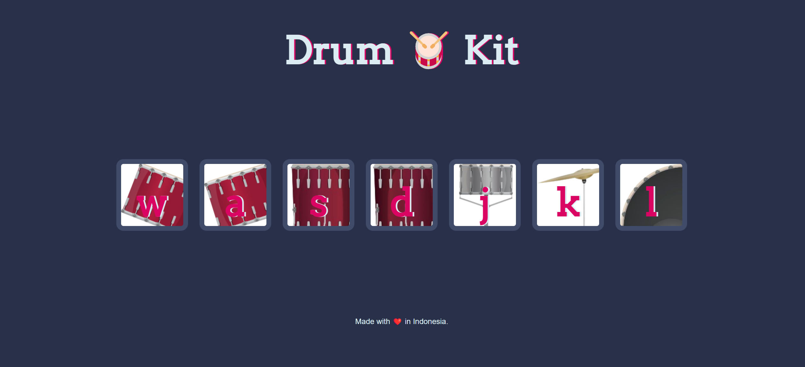
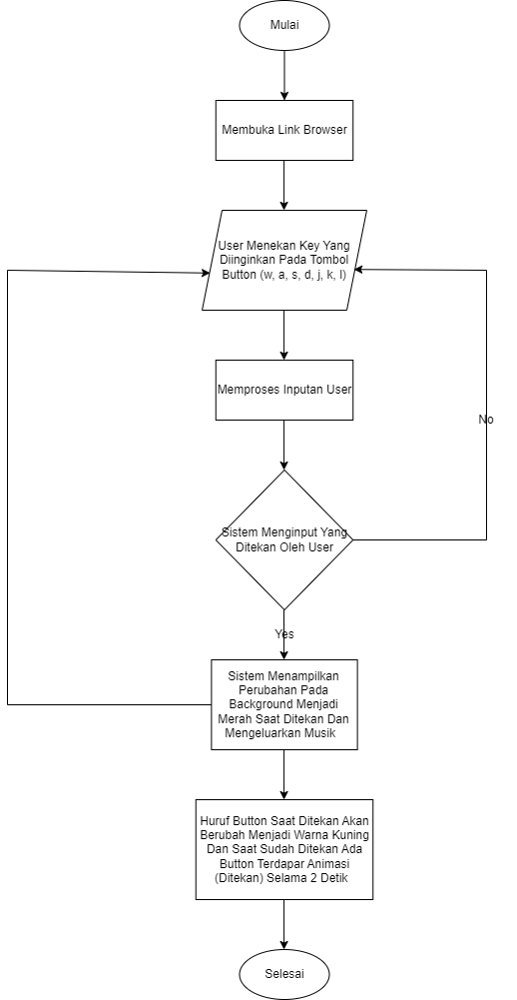

# DRUM KIT 

## Tugas Menambahkan : 
1. Keyboard ketik sesuai huruf => maka trigger suara sesuai button html nya.
2. Memberi animasi ke button yang di klik nya, misalkan warna buttonnya jadi merah lalu setelah 2 detik hilang merah nya.

## Dokumentasi Web Drum Kit 

## Flowchart
